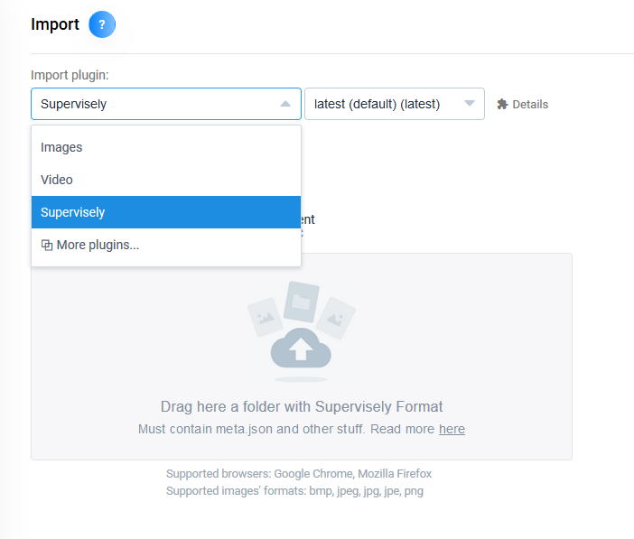
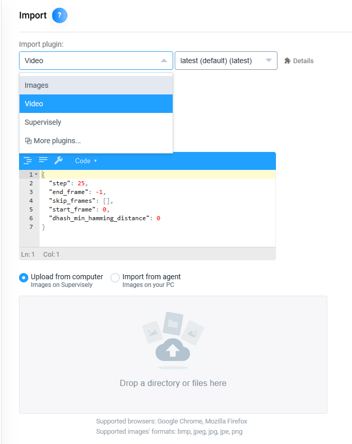
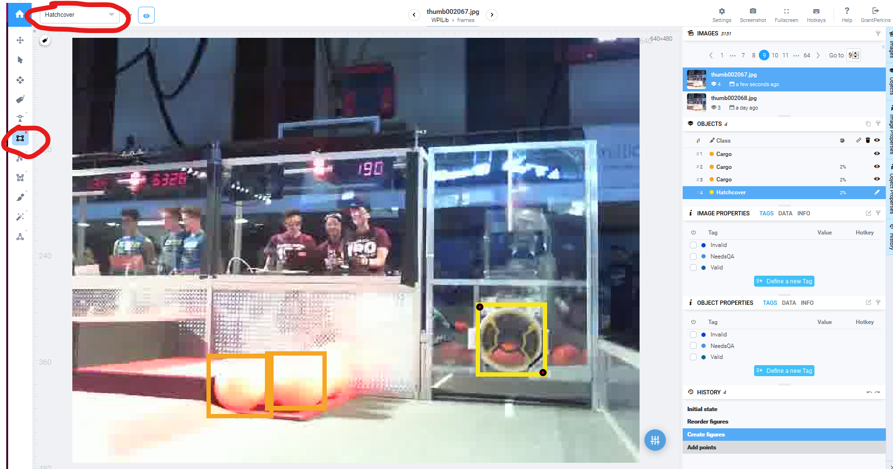
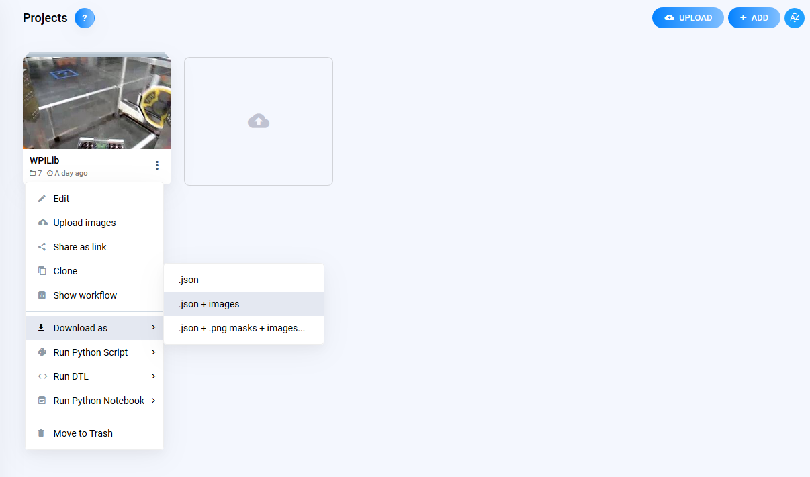

# WPILib-ML Docs -- LOCAL TRAINING ONLY

This document describes the steps needed to use a provided set of labeled images and make a trained model to deploy on a RasberryPi with a Google Coral. The basic steps are: gather new data, train your model, and run inference on a coprocessor.

## What You Will Need For Local Training:

    1. Docker. This is a program need to run the scripts in a virtual machine set up for them. There are some differences in the version of Docker you are using, so see the **Notes on using Docker** section for more info.

    2. A dataset. The docker container will come with a powercell dataset, but see the **Gathering Data** section to learn how to create your own.

### Notes on using Docker

    Depending on your operating system, you will be using different versions of docker. One important thing to keep in mind is that certain versions of docker (such as Docker Toolbox, using VirtualBox),
    requre additional steps to allocate enough ram for the training, and connect the network ports to allow the GUI to control the container.

## Training

### 1. Build the image:
        The first thing that you must do is build the docker image. This is easilly done by running the script "build.sh" (type ". build.sh" from the command prompt) from within the training/ folder in this repository. If you would like to permanently alter some of the training scripts, such as the default settings, this must be done before the image is built. 
    
### 2. Run the container:
        Now that you have built the image, you must use the image by running a docker container from that image. This is done by running the script "run.sh" (type ". run.sh" from the command prompt) from within the training/ folder. This script will automatically start the GUI server from within the container, and you will not have access to the inside. If you would like to have access to the inside of the container, to make changes, run the scripts manually and monitor the output, run the script "devrun.sh" from within the training/ folder instead. Right now, this is not reccomended.
    
### 3. Access the GUI:
        If the container has been started with "run.sh", a web-based GUI will be running in the container. To access it, open a web browser and type "localhost:5000" into the URL bar. It may take a moment for the server to start, but if it still wont connect to the GUI after a minute, you may need to open up port 5000 on the container manually. This will differ based on the version of docker you are using. 

### 4. Prepare the train job:

        model name: This is the name given to the checkpoints and finalized models generated.

        desired dataset: This is the dataset used to train the model. There will be a default dataset, but you will most likely want to add your own. Follow the guide in the **Gathering Data** section, and place the resulting .tar file in the directry mount/datasets/, which will be in the folder that you ran "run.sh" from (the training/ folder). After that, refresh the GUI page and you should see your dataset on the list.

        model to retrain: Here you will select the model that you wish to retrain. If you have not yet saved any checkpoints, or placed your own in the mount/checkpoints/ directory, then you should only see the famous mobilnet V2 that has been downloaded with the image.

        training steps: amount of times the the retraining program will retrain the model with the dataset. More steps USUALLY means a better model.

        batch size: this is how many peices of your dataset the retraining program will use on each training step. More is definitely better, but it is slower, and your container may run out of memory and kill the training job. You can allocate more memory to your container if you need it.

        steps before periodic evalution: The amount of training steps that it takes before one evaluation step to occur. The evaluation step measures the checkpoint's preformance, and temporarilly saves it. This is where all of your information comes from during trainjob, including the current train step that it is on. You will only be able to graph the preformance and save the checkpoints from the evaluation steps, so it is best to choose this number based on how much you want to monitor things during training. For example, if you have this set to 100, and your job is doing 100 train steps in total, you will not see a graph, or be able to save/export the model until the last training step is done.

        start tensorboard: Tensorboard is a seperate web application running from your local host, that will let you examine data from each evaluation step in very great detail. Definitly check this box if you really want to analize your model.

### 5. Retrain:

        Press "go", and the retraining will commence inside the container. You will be taken to a new page for monitoring and controlling the train job. Right now you must manually press the refresh button to recieve new data. At the top will be a few words about whats happening, and information on which epoch of the retraining you are on (this must be a multiple of the eval rate right now). It will take some time to get everython ready and start actually training, but eventually after the first evaluation you will be able to select data from the dropdown menu under the empy graph. Refresh the page and you should see the plotted data. 

        You have the option to "Copy Current Checkpoint" which does exactly what it says. The latest
        checkpoint will be saved to the mount/checkpoints/ directory. You will see that checkpoint on the main preparation page, and can launch a new train job from it.

        You also have the option to stop the train job whenever you want, and convert the latest checkpoint to a model that is ready to run on the Coral TPU chip. First the checkpoint will be saved as if you pressed the copy button, then the training will, stop, and the TPU conversion will begin.

### 6. Get your model:

        When the conversion has completed, whether you stopped the training or it finished, the model will be in the mount/finished-models/ directory in the folder that you started the container from. You will find a folder labelled with the name of the model and the time of completion. Inside it there will be a .tar.gz file which has an unoptimized .tflite model, and a .tflite model that is ready for the Coral edge TPU.
    
## Inference

1. Go to the training job in SageMaker, scroll to the bottom, and find the output S3 location
2. Download the the tar file in the bucket.
3. Setup your RasberryPI and Google Coral as described below.
4. FTP `model.tar.gz` into the home directory on the Pi.
5. Run the python script, using the command `python3 object_detection.py --team YOUR_TEAM_NUMBER`
6. Real time labelling can be found on an MJPEG stream located at `http://frcvision.local:1182`
7. The information about the detected objects is put to Network Tables. View the **Network Tables** section for more information about usable output.

### Raspberry Pi Setup
1. [Follow this guide](https://wpilib.screenstepslive.com/s/currentCS/m/85074/l/1027260-installing-the-image-to-your-microsd-card) in order to install the WPILib Raspberry Pi image. This will install an operating system and most of the WPILib software that you will use for machine learning. However, there are a few dependencies.
2. After successfully imaging your Pi, plug the Pi into your computer over ethernet. Open `frcvision.local` and change the file system to writeable. 
3. With the file system now editable, connect your Pi to an HDMI monitor with a USB keyboard and mouse, or connect via SSH if it is connected to the same network as your computer. PuTTY is a good tool for Windows to SSH.
4. After logging in with the username `pi` and the password `raspberry`, first change the default password to protect your Rasberry Pi.
5. Connect your Pi to the internet.
6. Run the following commands to install the proper dependencies used by the Google Coral.
```bash
sudo apt-get update

wget https://dl.google.com/coral/edgetpu_api/edgetpu_api_latest.tar.gz -O edgetpu_api.tar.gz --trust-server-names

tar xzf edgetpu_api.tar.gz

sudo edgetpu_api/install.sh #NOTE: TYPE 'Y' when asked to run at maximum operating frequency

cd ~

wget https://raw.githubusercontent.com/GrantPerkins/CoralSagemaker/master/utils/object_detection.py
```
7. You now have all dependencies necessary to run real-time inference.
8. When shutting down your Raspberry Pi run the command `sudo poweroff`. It is not recommended to simply unplug your Pi.


### Network Tables
- The table containing all inference data is called `ML`.
- The following entries populate that table:
1. `nb_boxes`     -> the number (double) of detected objects in the current frame.
2. `boxes_names`  -> a string array of the class names of each object. These are in the same order as the coordinates.
3. `boxes`        -> a double array containg the coordinates of every detected object. The coordinates are in the following format: [top_left__x1, top_left_y1, bottom_right_x1, bottom_right_y1, top_left_x2, top_left_y2, ... ]. There are four coordinates per box. A way to parse this array in Java is shown below.
```java
NetworkTable table = NetworkTableInstance.getDefault().getTable("ML");
int totalObjects = (int) table.getEntry("nb_boxes").getDouble(0);
String[] names = table.getEntry("boxes_names").getStringArray(new String[totalObjects]);
double[] boxArray = table.getEntry("boxes").getDoubleArray(new double[totalObjects*4]);
double[][][] objects = new double[totalObjects][2][2]; // array of pairs of coordinates, each pair is an object
for (int i = 0; i < totalObjects; i++) {
    for (int pair = 0; pair < 2; pair++) {
        for (int j = 0; j < 2; j++)
            objects[i][pair][j] = boxArray[totalObjects*4 + pair*2 + j];
    }
}
```

### Using these values
Here is an example of how to use the bounding box coordinates to determine the angle and distance of the game piece relative to the robot.
```java
String target = "cargo"; // we want to find the first cargo in the array. We recommend sorting the array but width of gamepiece, to find the closest piece.
int index = -1;
for (int i = 0; i < totalObjects; i++) {
    if (names[i].equals(cargo)) {
        index = i;
        break;
    }
}
double angle = 0, distance = 0;
if (index != -1) { // a cargo is detected
    double x1 = objects[index][0][0], x2 = objects[index][1][0];
    /* The following equations were made using a spreadsheet and finding a trendline.
     * They are designed to work with a Microsoft Lifecam 3000 with a 320x240 image output.
     * If you are using different sized images or a different camera, you will/may need to create your own function.
     */
    distance = (((x1 + x2)/2-160)/((x1 - x2)/19.5))/12;
    angle = (9093.75/(Math.pow((x2-x1),Math.log(54/37.41/29))))/12;
}
drivetrain.turnTo(angle);
drivetrain.driveFor(distance);
```

## Details of procedures used above

### Gathering Data

Machine Vison works by training an algorithm on many images with bounding boxes labeling each object you want the algorithm to recognize. WPILib provides thousands of labeled images for the 2019 game, which you can download below. However, you can train with custom data using this guide as well. If you want to just use the provided images from he instructions below describe how to gather and label your own data.

1. Plug a USB Camera into your laptop, and run a script similar to [record_video.py](utils/record_video.py), which simply makes a .mp4 file from the camera stream. The purpose of this step is to aquire images that show the objects you want to be able to detect.
2. Create a [supervise.ly](https://supervise.ly) account. This is a very nice tool for labelling data. After going to the [supervise.ly](https://supervise.ly) website, the Signup box is in the top right corner. Provide the necessary details, then click "CREATE AN ACCOUNT".
3. (Optional) You can add other teammates to your Supervise.ly workspace by clicking 'Members' on the left and then 'INVITE' at the top.
4. When first creating an account a workspace will be made for you. Click on the workspace to select it and begin working.
5. Upload the official WPILib labeled data to your workspace. (Note: importing files to supervise.ly is only supported for Google Chrome and Mozilla Firefox) [Download the tar here](https://github.com/GrantPerkins/CoralSagemaker/releases/download/v1/WPILib.tar), extract it, then click 'IMPORT DATA' or 'UPLOAD' inside of your workspace. Change the import plugin to Supervisely, then drag in the extracted FOLDER.(Note: Some applications create two folders when extracting from a .tar file. If this happens, upload the nested folder.) Then, give the project a name, then click import. 
6. Upload your own video to your workspace. Click 'UPLOAD' when inside of your workspace, change your import plugin to video, drag in your video, give the project a name, and click import. The default configuration, seen in the picture below, is fine. 

7. Click into your newly import Dataset. Use the `rectangle tool` to draw appropriate boxes around the objects which you wish to label. Make sure to choose the right class when you are labelling. The class selector is in the top left of your screen. 
8. Download your datasets from Supervise.ly. Click on the vertical three dots on the dataset, then "Download as", then select the `.json + images` option. 

### Building and registering the container

This code block runs a script that builds a docker container, and saves it as an Amazon ECR image. This image is used by the training instance so that all proper dependencies and WPILib files are in place.

## How it works

### Dockerfile

The dockerfile is used to build an ECR image used by the training instance. The dockerfile contains the following important dependencies:
 - TensorFlow for CPU
 - Python 2 and 3
 - Coral retraining scripts
 - WPILib scripts
 The WPILib scripts are found in /container/coral/


 ### Data
 
 Images should be labelled in Supervisely. They should be downloaded as jpeg + json, in a tar file.
 When the user calls `estimator.fit("s3://bucket")`, SageMaker automatically downloads the content of that folder/bucket to /opt/ml/input/data/training inside of the training instance.
 
 The tar is converted to the 2 records and .pbtxt used by the retraining script by the tar_to_record.sh script. It automatically finds the ONLY tar in the specified folder and extracts it. It then uses json_to_csv.py to convert the jsons to 2 large csv files. generate_tfrecord.py converts the csv files into .record files. Finally, the meta.json file is parsed by parse_meta.py to create the .pbtxt file, which is a label map.
 
 ### Hyperparameters
 
 At the moment, the only hyperparameter that you can change is the number of training steps. The dict specified in the notebook is written to `/opt/ml/input/config/hyperparameters.json` in the training instance. It is parsed by hyper.py, and is used when calling ./retrain_....sh in train.
 
 ### Training
 
 `estimator.fit(...)` calls the `train` script inside the training instance. It downloads checkpoints, creates the records, trains, converts to .tflite, and uploads to S3.
 
 ### Output
 
 The output `output.tflite` is moved to `/opt/ml/model/output.tflite`. This is then automatically uploaded to an S3 bucket generated by SageMaker. You can find exactly where this is uploaded by going into the completed training job in SageMaker. It will be inside of a tar, inside of a .tar. I don't know why yet.
